# HCD Cluster Management - Workflow Diagrams

## Overall Architecture

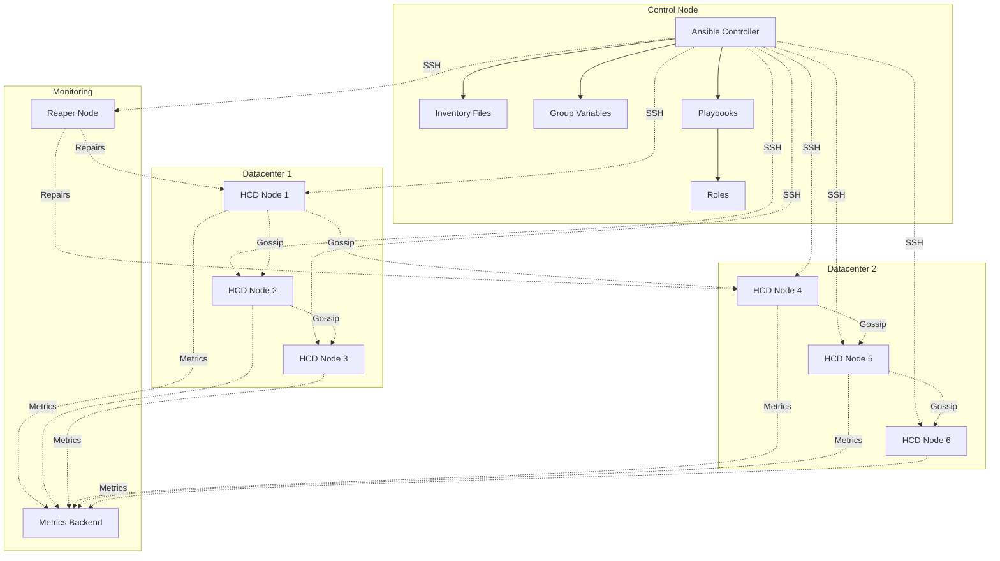

## Deployment Workflow

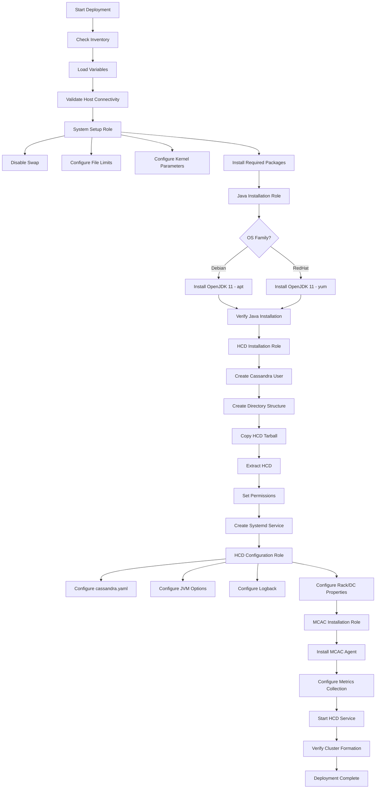

## Configuration Update Workflow

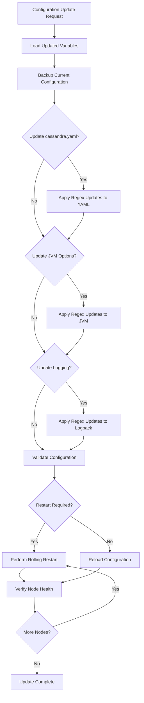

## Role Execution Order

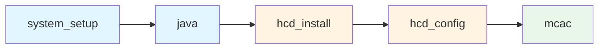

## Multi-Datacenter Deployment Strategy

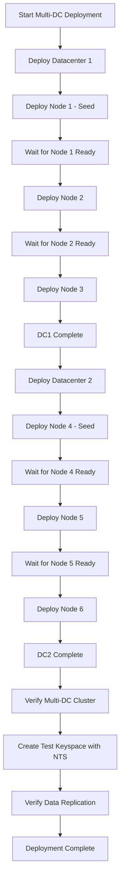

## Monitoring Stack Integration

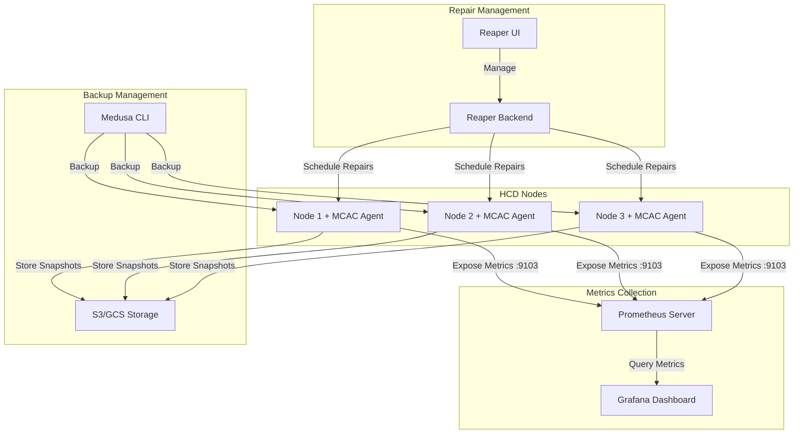

## Rolling Restart Process

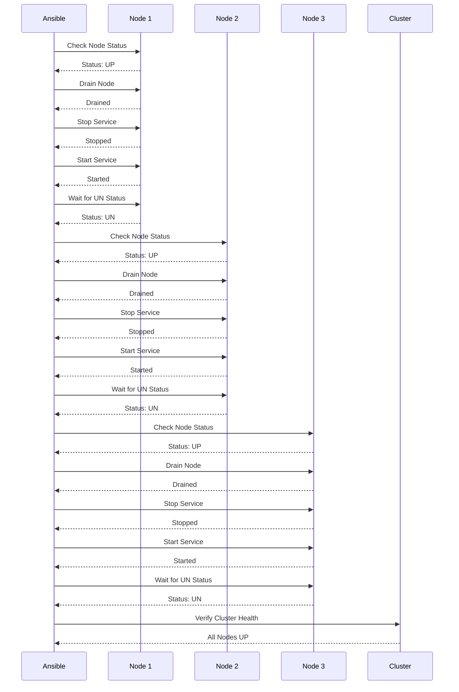

## Variable Inheritance Flow

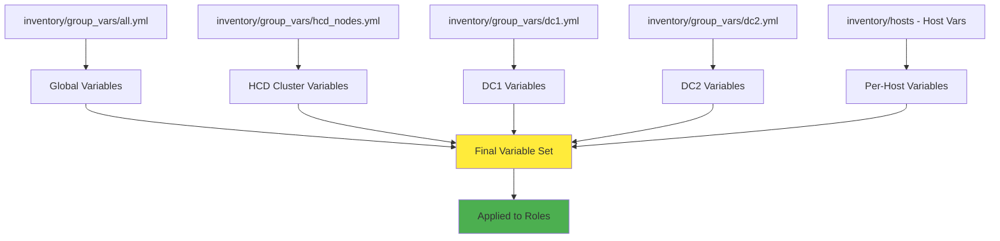

## File Structure Overview

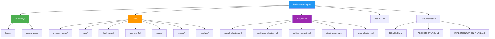

## Decision Tree for Configuration Method

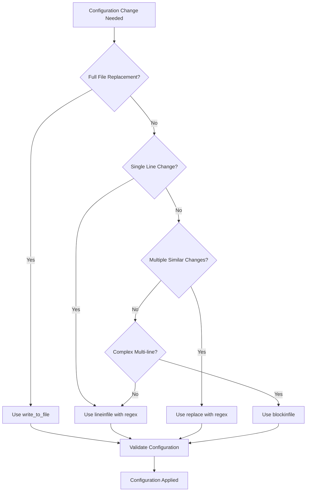

## Backup and Restore Workflow

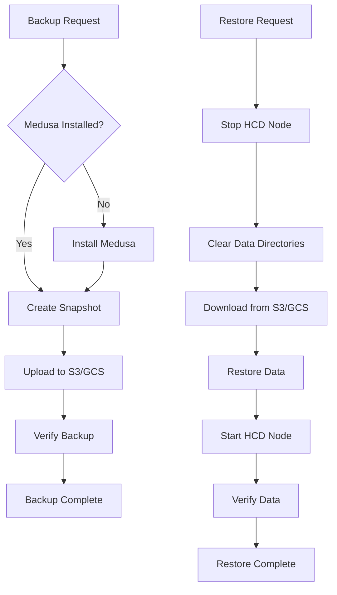

## Notes

- All diagrams use Mermaid syntax for easy rendering in Markdown viewers
- Workflows show the logical flow of operations
- Architecture diagrams illustrate component relationships
- Decision trees help choose the right approach for different scenarios